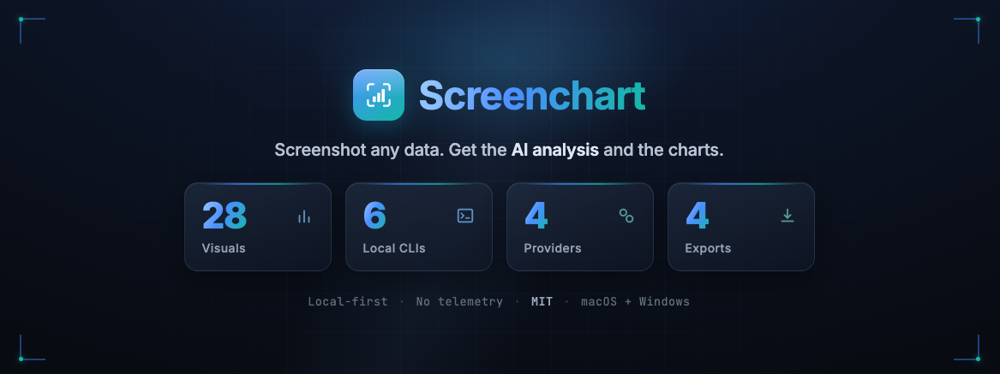
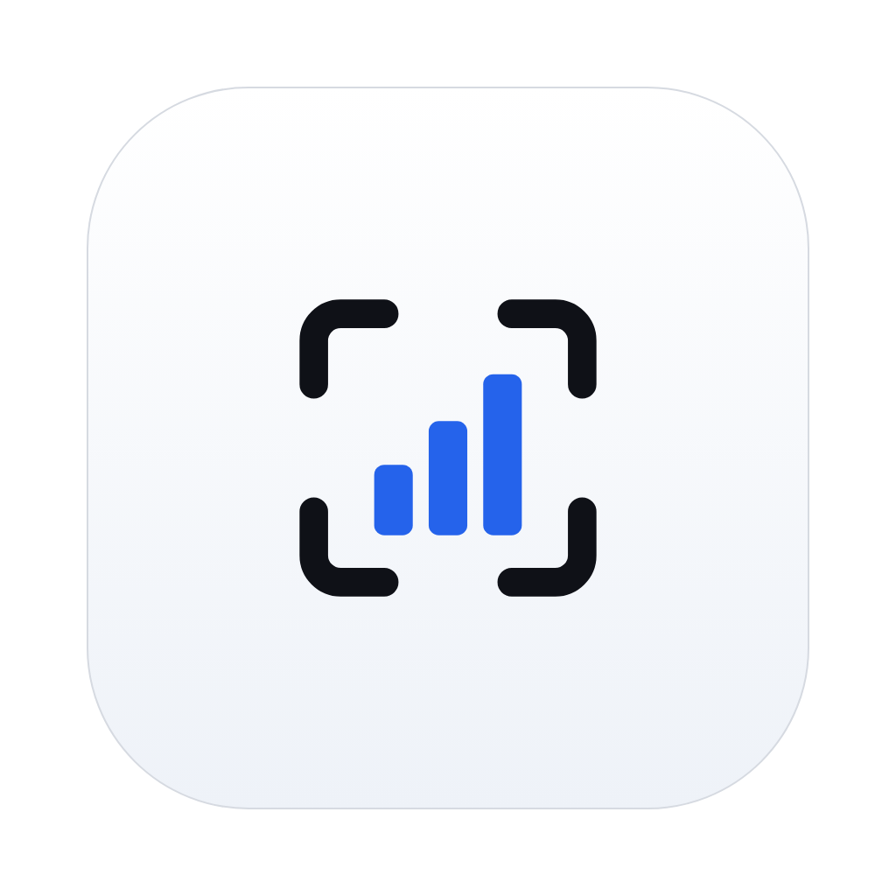

<h1 align="center">Screenchart</h1>

<p align="center"><b>Press a hotkey from anywhere (or click Capture in the app) → screenshot any data → get a plain-English answer + the right visualization, from 28 chart &amp; map types.</b></p>

<p align="center">Local-first · model-agnostic · open source. The model reads your screen; the app does the math.</p>

<p align="center">
  <!-- TODO(ashish): replace docs/screenshots/hero.png with a wide hero banner (see IMAGES list in the PR). -->
  
</p>

<p align="center">
  <a href="https://screenchart.app">Website</a> ·
  <a href="https://github.com/AshishB2000/screenchart/releases">Download</a> ·
  <a href="https://github.com/AshishB2000/screenchart/discussions">Discussions</a> ·
  <a href="https://github.com/AshishB2000/screenchart/issues">Issues</a>
</p>

<p align="center">
  <a href="https://github.com/AshishB2000/screenchart/releases"></a>
  <a href="LICENSE"></a>
  
  
</p>

---

## What is Screenchart

📸 **Screenshot anything on screen** — a chart, a table, a dashboard, a PDF, a spreadsheet.
🧠 **A vision model reads it** and answers in plain English. 📊 **The app draws the right chart**
(Chart.js) **or map** (Leaflet) from the data it extracted. 🔒 **Local-first & private** — runs
on a **local CLI you already have** or your **own API key**; no accounts, no telemetry.
💾 Export to **PDF · Word · PPT**, and keep a **capture history** on disk.

**Core principle:** the model *extracts and classifies* the numbers; the **app does the
arithmetic** — deterministic and auditable, so the headline figure is never something the model
made up. You get an insight, not a hallucination.

Drag a box around on-screen data, and Screenchart turns it into an answer + a visualization,
without leaving what you're doing. Each capture is a **conversation** — ask follow-ups and it
keeps the thread.

---

## See it in action

<!--
  END-TO-END DEMO. Two ways to fill this (pick one):
  1) GitHub-hosted MP4 (plays inline with sound): drag the .mp4 into a GitHub issue/PR
     comment, copy the resulting https://github.com/user-attachments/assets/... URL, and
     paste it here as a bare line or inside <video src="..."></video>. Renders only on github.com.
  2) Silent looping GIF (autoplays everywhere): save it as docs/screenshots/demo.gif and use
     the  below (swap .png → .gif).
-->
<p align="center">
  
</p>

---

## Product tour

> Images below are placeholders (the app logo) until real screenshots land — see the **Images
> needed** list in the PR description.

### Capture → analyze → visualize

<table>
<tr>
<td valign="top">
<br/>
<sub><b>Capture</b> — press the hotkey (<b>⌘⌥S</b> on macOS, configurable), the display under your cursor dims with a frozen snapshot, and you drag a box around the data.</sub>
</td>
</tr>
</table>

<table>
<tr>
<td width="50%" valign="top">
<br/>
<sub><b>Analysis + chart</b> — a number-accurate headline, plain-English analysis, and the recommended chart. Switch chart types, tweak values/periods, and drill in.</sub>
</td>
<td width="50%" valign="top">
<br/>
<sub><b>Maps</b> — genuinely geographic data renders as a Leaflet bubble/choropleth map (OpenStreetMap tiles).</sub>
</td>
</tr>
<tr>
<td width="50%" valign="top">
<br/>
<sub><b>Follow-ups</b> — each capture is a thread. Ask "what's the trend?" or "flag the risks" and it answers against the same screenshot.</sub>
</td>
<td width="50%" valign="top">
<br/>
<sub><b>Export</b> — send the result (charts and maps included) to <b>PDF</b>, <b>Word</b>, or <b>PowerPoint</b>.</sub>
</td>
</tr>
</table>

---

## Visualizations

Screenchart picks the visual that fits the data it extracted — and you can switch to any of
**28 chart &amp; map types** from the `⋯` menu (Recommended / Selected / + More). Grouped data
supports Values/Periods toggles and small multiples where they fit.

| Group | Types |
|---|---|
| **Bar &amp; column** | Column · Clustered column · Stacked column · 100% stacked column · Bar · Clustered bar · Stacked bar · 100% stacked bar |
| **Line &amp; area** | Line · Line with markers · Area · Stacked area · Line + column (combo) |
| **Part-to-whole** | Pie · Donut · Treemap · Funnel |
| **Distribution &amp; relationship** | Scatter · Bubble · Histogram · Box plot · Heatmap |
| **Flow &amp; finance** | Sankey · Candlestick |
| **Single value / tabular** | Gauge · Table |
| **Maps** | Region map (choropleth) · Bubble map |

Charts render with **Chart.js 4** (+ treemap, sankey, matrix, financial, and boxplot plugins);
maps with **Leaflet** (OpenStreetMap tiles).

---

## Two ways to run it

Screenchart never ships or installs a model. It **runs a local CLI you already have**, or calls a
**cloud API with your own key**. Pick per your privacy/latency needs in **Settings → Execution**.

<table>
<tr>
<td valign="top">
<br/>
<sub><b>Execution settings</b> — choose a detected Local CLI, or bring your own key for a cloud provider.</sub>
</td>
</tr>
</table>

### 🖥️ Local CLI (default) — detect &amp; run only, never install

Screenchart detects agent CLIs already on your `PATH` and runs them in read-only mode. It
**never** runs `npm/brew/curl install` — the "Install" button only opens the vendor's page.

| Local CLI | Vendor |
|---|---|
| [Claude Code](https://docs.anthropic.com/en/docs/claude-code/overview) | Anthropic |
| [Antigravity](https://antigravity.google) | Google |
| [Codex CLI](https://github.com/openai/codex) | OpenAI |
| [Grok CLI](https://github.com/superagent-ai/grok-cli) | xAI (community) |
| [OpenCode](https://opencode.ai) | opencode.ai (BYOK) |
| [Cursor Agent](https://cursor.com/cli) | Cursor (Anysphere) |

### 🔑 BYOK — bring your own key

Encrypted per-provider on your machine (never logged, never sent to a renderer).

| Family | Endpoints |
|---|---|
| **Anthropic** | Claude API |
| **OpenAI** | OpenAI API |
| **Gemini** | Google Gemini API |
| **Gateway** | Any OpenAI-compatible endpoint — OpenRouter, Ollama, LM Studio, or a custom URL |

---

## Why Screenchart

Your data is trapped in a picture — a chart in a slide, a table in a PDF, a dashboard you can't
export. The usual options are all bad: squint and eyeball it, re-type it into a spreadsheet, or
upload the screenshot to a cloud chatbot that may invent the numbers.

Screenchart is the local-first, number-honest alternative:

- 🔒 **Local & private.** Runs on a local CLI or your own key. No accounts, no telemetry, no
  surprise network calls. The only declared external fetch is OpenStreetMap tiles — and only when
  a map is shown.
- 🧮 **Number-accurate by design.** The model extracts raw values and classifies the data; the app
  computes every metric and writes the headline. The model is **forbidden** from writing computed
  numbers, so the figure you read is the figure that was there.
- 🤖 **Model-agnostic.** The `claude` / `codex` / `cursor-agent` / … already on your `PATH` are the
  engine — or any cloud API via BYOK. Swap freely.
- 📊 **Charts and maps, not just text.** Chart.js (bars, lines, treemap, sankey, matrix, boxplot,
  financial) and Leaflet maps, picked to fit the data.
- 💬 **Conversational.** Every capture is a thread — follow-ups replay the full context.
- 📦 **Yours to keep.** History persists on disk; export to PDF / Word / PPT.

### Comparison

| | Eyeball + calculator | Re-type into a spreadsheet | Cloud AI chatbot | **Screenchart** |
|---|:---:|:---:|:---:|:---:|
| No manual re-typing | ❌ | ❌ | ✅ | **✅** |
| Numbers computed by the app (not guessed) | you do it | you do it | ❌ (model may invent) | **✅** |
| Charts + maps generated | ❌ | manual | sometimes | **✅** |
| Runs locally / private | ✅ | ✅ | ❌ | **✅ (local CLI)** |
| Bring your own model/key | — | — | rarely | **✅** |
| Export PDF / Word / PPT | ❌ | manual | ❌ | **✅** |
| Open source | — | — | ❌ | **✅ MIT** |

---

## Quick start

### 🖥️ Download the app (recommended)

- **macOS** (Apple Silicon + Intel, universal) → [GitHub Releases](https://github.com/AshishB2000/screenchart/releases)
- **Windows** (x64) → [GitHub Releases](https://github.com/AshishB2000/screenchart/releases)
- **Linux** — planned.

macOS builds are self-signed (no paid Apple certificate yet), so on first launch macOS shows
"Apple could not verify…". Right-click the app → **Open** once to get past it. Full setup and the
Screen Recording grant are in [QUICKSTART.md](QUICKSTART.md).

### 🧑‍💻 Run from source

```bash
git clone https://github.com/AshishB2000/screenchart.git
cd screenchart
npm install          # postinstall fetches map GeoJSON
npm start
```

Requirements: [Node.js](https://nodejs.org/) 18+ and npm. No build step in dev — plain JS loads
directly. Packaging installers uses electron-builder (`npm run dist:mac` / `npm run dist:win`).

### First capture

1. In **Settings → Execution**, pick a detected Local CLI or add an API key.
2. Press the capture hotkey from any app — **⌘⌥S** (macOS) / **Ctrl+Alt+S** (Win/Linux), configurable.
3. Drag a box around a chart, table, or any data.
4. Read the plain-English analysis + chart; ask a follow-up; export if you want.

---

## How the capture loop works

The full display **under your cursor** is captured first (a "frozen frame"), painted into a
dimming overlay, and your selected region is cropped from that still image — so the overlay never
appears in the result. The crop goes to your configured model (inline over HTTPS for BYOK, or a
temp file handed to the local CLI), which returns a strict JSON envelope: raw extracted table +
data shape + suggested calculations + a number-free headline angle. The app validates it, does the
arithmetic, composes a number-accurate headline, and renders the chart or map.

Architecture and internals → [CLAUDE.md](CLAUDE.md).

---

## Platform notes

### macOS — Screen Recording permission
macOS requires **Screen Recording** permission, or captures come back **black**. On first capture,
grant it in **System Settings → Privacy & Security → Screen Recording**, then relaunch. In dev you
grant it to whatever launches Electron (your terminal / `Electron.app`), not "Screenchart" — that
applies once packaged.

### Linux — Wayland
On **Wayland**, global hotkeys and screen capture are unreliable (the hotkey may fail to register;
capture may trigger a portal picker). **X11 is recommended.** The app detects Wayland and warns.

### HiDPI / Retina
Captures are cropped from the actual returned bitmap resolution, so selections stay accurate on
Retina and Windows display-scaling (125–150%).

---

## Privacy

Local-first is a core promise. Captures, history, and settings stay on your machine. Analysis
sends the cropped image (plus your prompt) to **the model you chose** — a local CLI process, or
your BYOK cloud endpoint over HTTPS — and nowhere else. No telemetry, no analytics, no
crash-reporting, no auto-updater. OpenStreetMap tiles are the one declared external fetch, only
when a map renders. Full details → [PRIVACY.md](PRIVACY.md).

> **API keys** are stored in `userData/config.json` (gitignored). See PRIVACY.md for the exact
> storage details before adding a key.

---

## Roadmap

- [x] Capture loop (frozen-frame, multi-monitor, drag-select)
- [x] Analysis → compute → number-accurate headline
- [x] Charts (Chart.js + plugins) and maps (Leaflet)
- [x] Two execution modes — Local CLI + BYOK (Anthropic / OpenAI / Gemini / gateway)
- [x] Follow-up conversations, per-capture history on disk
- [x] Export to PDF / Word / PPT
- [x] macOS (universal) + Windows builds via electron-builder
- [ ] Linux builds
- [ ] Memory / summarization step (config integration point exists; nothing consumes it yet)

---

## Contributing

Issues and PRs welcome. New work goes on a branch off `main` and merges via PR — see
[CLAUDE.md](CLAUDE.md) for conventions. File bugs and feature requests through the
[issue templates](https://github.com/AshishB2000/screenchart/issues/new/choose); ask questions in
[Discussions](https://github.com/AshishB2000/screenchart/discussions).

### Developer scripts
Helper scripts live in the **screenchart-dev skill** at
[`.claude/skills/screenchart-dev/scripts/`](.claude/skills/screenchart-dev/scripts/) (POSIX bash):

| Script | What it does |
|---|---|
| `check-prereqs.sh` | Verify the build env: Node 18+, npm, authenticated `gh`, electron-builder. |
| `setup-workspace.sh` | Bootstrap a fresh clone (prereqs + `npm install`). |
| `create-pr.sh` | Push the current branch and open a PR into `main` (refuses on `main`). |
| `create-issue.sh` | Open a GitHub issue in `AshishB2000/screenchart`. |

```bash
bash .claude/skills/screenchart-dev/scripts/setup-workspace.sh
```

---

## License

[MIT](LICENSE) © Screenchart contributors.
